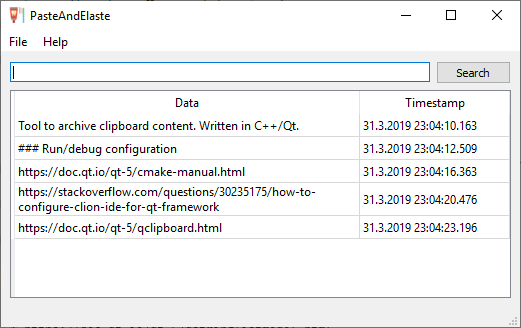
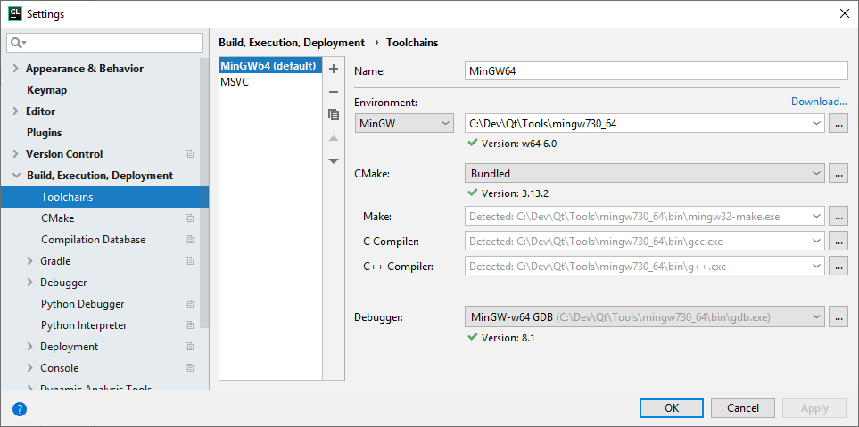
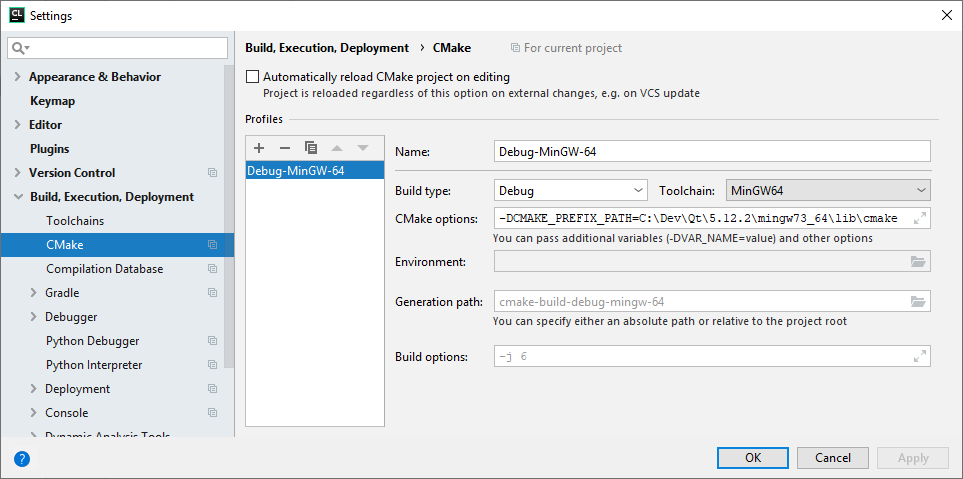
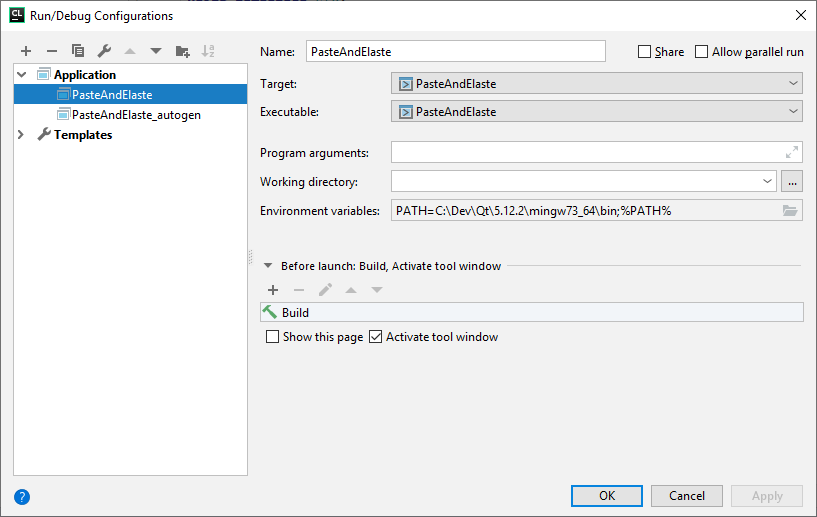

# PasteAndElaste

Tool to archive clipboard content. Written in C++/Qt.

## Credits

Icons made by [Smashicons](https://www.flaticon.com/authors/smashicons) 
from [www.flaticon.com](https://www.flaticon.com/) is licensed by 
[CC 3.0 BY](http://creativecommons.org/licenses/by/3.0/).

## Vision 

* Duplication detection, do not add the same content twice to the list (except it is older than x hours) 
* Search functionality
* Hotkeys / Shortcuts
    * e.g. <key>Ctrl</key>+<key>#</key> to open program as a popup 
    * e.g. <key>Ctrl</key>+<key>1</key>, <key>Ctrl</key>+<key>2</key>, ... to paste clipboard content from Slot 1, 2, ... 
* Copying images
* Assistance and source code highlighting when copying source code
* Preview when copying URLs
* Persistence (using SQLite)

## How to Build

### Windows (x64), MinGW 7.3, Qt 5.12

After checkout, set In CMakeList.txt setup CMAKE_PREFIX_PATH to directory containing Qt (e.g. ``C:\Dev\\Qt\5.12.2\mingw73_64\lib\cmake``)

#### IDE settings for CLion

Setup the Toolchain (_Settings > Build, Execution, Deployment > Toolchains_) according to the following screenshot:

Setup CMake (_Settings > Build, Execution, Deployment > CMake_) according to the following screenshot:\

Setup a Run configuration according to the following screenshot:

References:

* https://stackoverflow.com/questions/30235175/how-to-configure-clion-ide-for-qt-framework
* https://stackoverflow.com/a/50204707/2689391
* https://doc.qt.io/qt-5/cmake-manual.html

### How to deploy?

To be researched.

* https://doc.qt.io/qt-5/windows-deployment.html
* https://books.google.de/books?id=RPlqDwAAQBAJ&pg=PA453&lpg=PA453&dq=makefile+windeployqt&source=bl&ots=cMiHqo2ZA4&sig=ACfU3U1HelJ7mAJZVmhcoA4uG8VzcUwUsA&hl=de&sa=X&ved=2ahUKEwjekcfe7aXhAhXECOwKHTBdD68Q6AEwBXoECAkQAQ#v=onepage&q=makefile%20windeployqt&f=false

## Useful links

* https://doc.qt.io/qt-5/qtexamplesandtutorials.html
* https://doc.qt.io/qt-5/signalsandslots.html
* https://doc.qt.io/qt-5/qclipboard.html
* https://doc.qt.io/qt-5/model-view-programming.html
* https://doc.qt.io/qt-5/modelview.html
* https://doc.qt.io/qt-5/qstringlistmodel.html
* https://doc.qt.io/qt-5/sql-presenting.html
* https://doc.qt.io/qt-5.11/qtsql-cachedtable-example.html
* https://stackoverflow.com/questions/3492739/auto-expanding-layout-with-qt-designer
