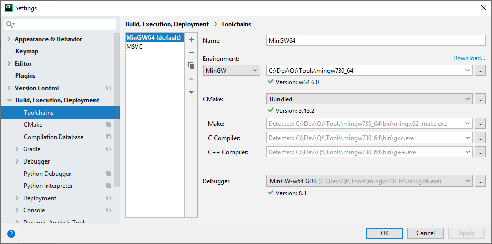
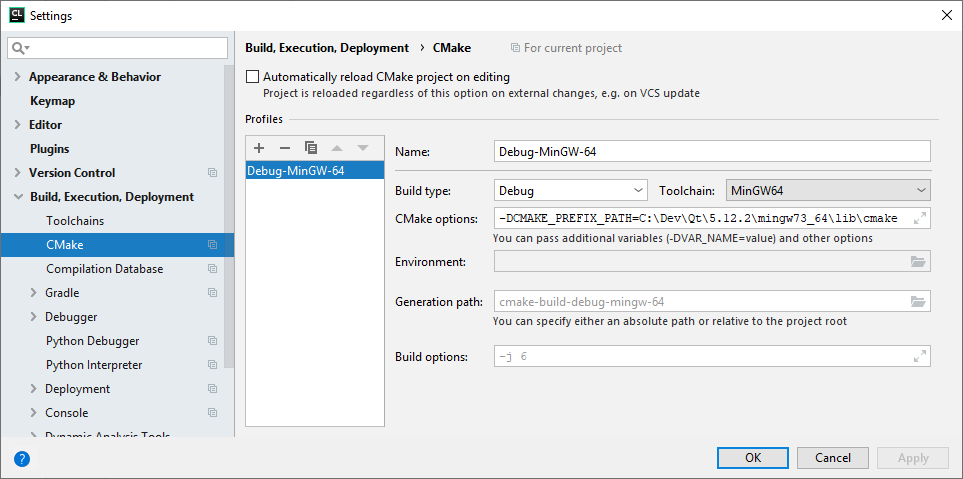
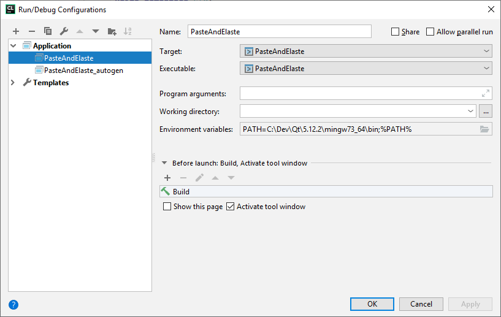

# PasteAndElaste

Tool to archive clipboard content. Written in C++/Qt.

## How to setup CLion for Qt

### Toolchain

### CMake

### Run/debug configuration

Sources: 

* https://stackoverflow.com/questions/30235175/how-to-configure-clion-ide-for-qt-framework
* https://stackoverflow.com/a/50204707/2689391
* https://doc.qt.io/qt-5/cmake-manual.html

## How to deploy?

To be researched.

https://doc.qt.io/qt-5/windows-deployment.html

## Useful links

* https://doc.qt.io/qt-5/qtexamplesandtutorials.html
* https://doc.qt.io/qt-5/signalsandslots.html
* https://doc.qt.io/qt-5/qclipboard.html
* https://doc.qt.io/qt-5/model-view-programming.html
* https://doc.qt.io/qt-5/modelview.html
* https://doc.qt.io/qt-5/qstringlistmodel.html
* https://doc.qt.io/qt-5/sql-presenting.html
* https://doc.qt.io/qt-5.11/qtsql-cachedtable-example.html

* https://stackoverflow.com/questions/3492739/auto-expanding-layout-with-qt-designer